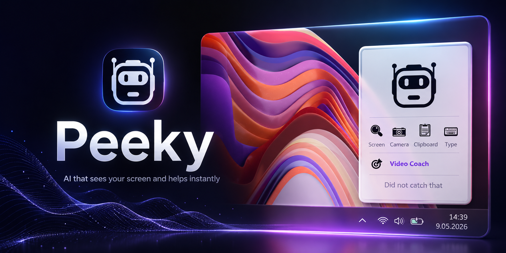
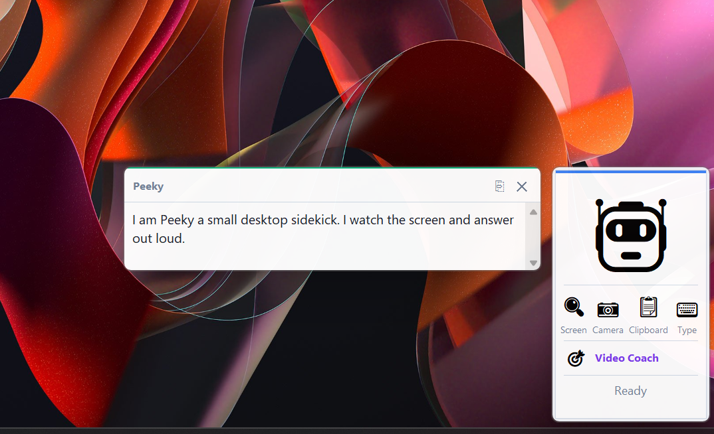
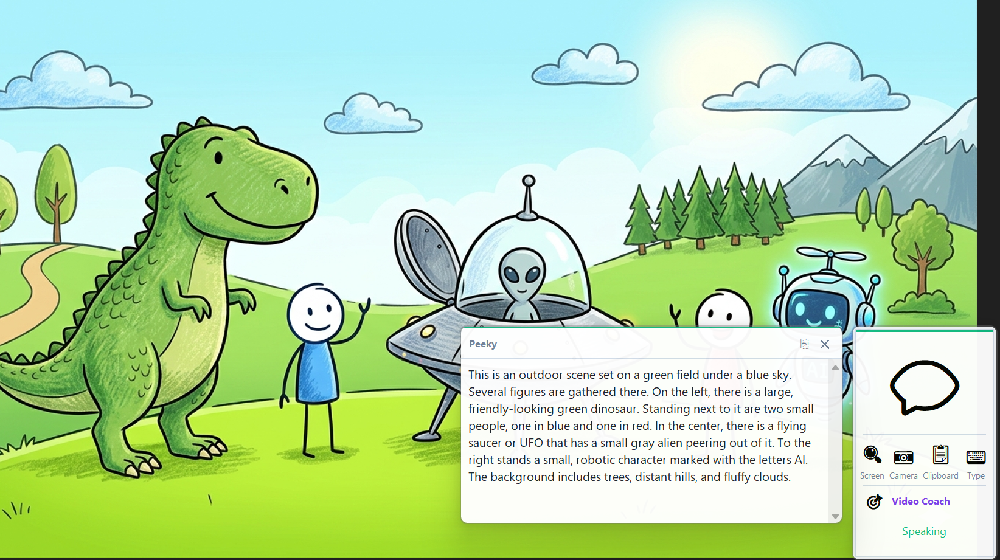

<p align="center">
  
</p>

# Peeky

**See. Think. Help.**

Peeky is your AI sidekick for the desktop. A small widget that lives in the corner of your screen, watches what you point it at, listens to what you ask, and answers out loud. Everything is processed locally by Ollama. Nothing leaves your machine unless you explicitly choose the online speech services.

## Features

* **Voice conversations** in plain English. Speech recognition through Google when online, faster-whisper when offline. Voice replies through edge-tts when online, the Windows SAPI Zira voice when offline.
* **Screen capture mode.** Drag a rectangle, ask a question about it. The selected region is sent to a local multimodal model.
* **Camera mode.** Snap a photo with your webcam, ask a question about what is in the frame. A small preview confirms what was captured.
* **Clipboard mode.** Send the current clipboard contents straight to the model for analysis, summarization, translation, or explanation.
* **Text mode.** Type a question without speaking. Useful in quiet rooms.
* **Video Coach.** A guided coaching loop for hands-on tasks. Peeky captures a baseline frame, listens to your goal, walks you through the steps, then keeps re-checking the camera until it has visual evidence the task is complete.
* **Memory timeline.** Every interaction is timestamped and stored locally. Browse the history through the right-click menu.
* **Always-on-top widget.** Drag it anywhere. Stays out of the way until you click it.
* **Fully offline operation.** With one local model and faster-whisper installed, the entire stack runs without an internet connection.

## Peeky in action

<p align="center">
  
</p>

*Talk to Peeky out loud. Click the agent, say what you need, click again to stop. The reply appears in the bubble and is spoken back to you.*

<p align="center">
  
</p>

*Show Peeky anything on screen: a chart, a diagram, a photo, a slide. Drag a rectangle around it, ask a question, and Peeky describes or analyzes what you selected. The whole pipeline runs locally through Ollama, so it works offline too.*

## How it works

| Stage             | Online                | Offline                  |
|-------------------|-----------------------|--------------------------|
| Microphone        | ffmpeg + DirectShow   | ffmpeg + DirectShow      |
| Speech to text    | Google Speech API     | faster-whisper (base)    |
| Reasoning         | Ollama (local)        | Ollama (local)           |
| Text to speech    | edge-tts (Aria)       | pyttsx3 + SAPI (Zira)    |

A two-second connectivity probe runs at the start of every speech-to-text and text-to-speech step. When there is no internet, Peeky skips the online services entirely. There is no waiting on TCP timeouts.

## Requirements

* Windows 10 or 11
* Python 3.10 or newer
* [Ollama](https://ollama.com) running locally
* A microphone enabled in Windows privacy settings
* FFmpeg (bundled through the `imageio-ffmpeg` package, no separate install needed)
* About 8 GB of free disk space for models

## Installation

You need three things installed first:

1. **Python 3.10 or newer.** Download from [python.org](https://www.python.org/downloads/). On the installer screen, tick **"Add Python to PATH"**.
2. **Ollama.** Download from [ollama.com](https://ollama.com) and run the installer.
3. **A microphone.** Open Windows Settings, search for "microphone privacy", and make sure "Let desktop apps access your microphone" is on.

Then:

```powershell
# 1. Clone or download this repository
git clone https://github.com/tomaszwi66/peeky.git
cd peeky

# 2. Run the one-click setup script
install.bat

# 3. Launch
run.bat
```

`install.bat` pulls the Python dependencies and the `gemma4:e4b` model (about 3 GB). The first launch also downloads the faster-whisper base model (about 140 MB) for offline speech recognition. After that, everything is cached locally.

### Manual installation

If you prefer to do it by hand:

```powershell
pip install -r requirements.txt
ollama pull gemma4:e4b
python peeky.py
```

### Using a different model

Peeky picks any installed multimodal model on startup. To force a specific one:

```powershell
set PEEKY_MODEL=qwen2.5vl:7b
python peeky.py
```

## Usage

The widget shows an emoji that reflects its current state. The colored bar across the top changes color too.

| Action                          | What happens                                          |
|---------------------------------|-------------------------------------------------------|
| Click the agent                 | Start voice recording. Click again to stop and send.  |
| Click 🔍 Screen                  | Drag a rectangle, then ask about it by voice.         |
| Click 📷 Camera                  | Snap a webcam photo, then ask about it by voice.      |
| Click 📋 Clipboard               | Send the current clipboard text to the model.         |
| Click ⌨️ Type                    | Open a small dialog to type a question.               |
| Click 🎯 Video Coach             | Capture a baseline, describe the task, follow the loop. |
| Right-click the agent           | Menu: copy reply, history, clear context, quit.       |
| Drag the agent                  | Move it around the screen.                            |
| Press `Esc`                     | Cancel recording or stop Video Coach.                 |

### Voice recording

Click once to start, click again to stop. The widget turns red while it listens. The status line shows what stage the pipeline is in: connection check, transcription, model thinking, speaking.

### Screen mode

Click the 🔍 button. The screen dims and a crosshair appears. Drag a rectangle around what you want to ask about. After releasing, the agent flips to recording mode. Speak your question and click to stop. The captured region and your question are sent to the local model together.

### Video Coach

Click 🎯 to start a coaching session. Peeky takes a baseline photo, then asks you to describe what you want to do. After you describe the task, Peeky:

1. Asks the model for the first concrete step and a description of what the finished state looks like.
2. Speaks the first step.
3. After speaking, captures a fresh frame.
4. Sends both the baseline frame and the new frame to the model and asks it to compare progress.
5. Either speaks the next step, or signals completion. Completion claims must be repeated on a second check before the session ends. This prevents false positives.

The session state is saved to `coach_state.json` while the loop is active. The file is removed when the task completes or you stop the session.

To stop early: press `Esc`, or click the red `● STOP` label on the Coach button.

## Configuration

You can configure Peeky through environment variables, or by editing the constants near the top of `peeky.py`.

| Variable          | Default            | Notes                                              |
|-------------------|--------------------|----------------------------------------------------|
| `PEEKY_MODEL`     | auto-detect        | Forces a specific multimodal Ollama model. If unset, Peeky picks the first available one (preferring `gemma4:e4b`). |

In-file constants:

| Name              | Default            | Purpose                                            |
|-------------------|--------------------|----------------------------------------------------|
| `TTS_VOICE_ON`    | `en-US-AriaNeural` | edge-tts voice for online speech                   |
| `TTS_VOICE_OFF`   | `Zira`             | Substring matched against installed SAPI voices    |
| `STT_LANGUAGE`    | `en-US`            | Language hint for both Google STT and faster-whisper |
| `IMG_MAX_PX`      | `768`              | Images are downscaled to this size on the longer side before reaching the model |
| `OLLAMA_TIMEOUT`  | `180`              | Seconds before a model call is given up on        |

## File layout

```
peeky.py             main application
peeky_icon.ico       application icon
install.bat          one-click setup for Windows
run.bat              one-click launch for Windows
README.md            this file
requirements.txt     Python dependencies
LICENSE              MIT license
.gitignore
docs/assets/         screenshots used in this README
peeky.log            runtime log, rewritten on each launch
memory.json          interaction timeline (created on first reply)
coach_state.json     transient state during a Video Coach session
```

## Privacy

* The model runs locally through Ollama. Your prompts, images, and replies stay on your machine.
* Online services are only used when you have an internet connection AND when you have not disabled them.
  * Google Speech API receives the audio buffer of your spoken question.
  * Microsoft edge-tts receives the text of the reply to synthesize speech.
* When offline, Peeky uses faster-whisper for speech recognition and SAPI for speech synthesis. Neither sends data anywhere.
* The interaction history in `memory.json` is plain JSON. Delete the file or use the "Clear memory" button to wipe it.

## Troubleshooting

**"Ollama is not running."** Start the Ollama desktop app or run `ollama serve` in a terminal.

**Model does not see images.** Make sure the configured model is multimodal. Text-only models silently ignore images. `gemma4:e4b`, `llava`, and `bakllava` all support vision.

**No microphone detected.** Open Windows Settings > Privacy & security > Microphone, and allow desktop apps to use it.

**Recording was too short.** The recording was under one second. Click, speak, then click again to stop.

**Offline STT unavailable.** `faster-whisper` is not installed, or the base model has not been downloaded yet. Run the app once with an internet connection, or `pip install faster-whisper` and let it download on first use.

**Video Coach keeps saying the task is complete.** Make sure your webcam can see clear visual progress. The coach requires a minimum of two analysis steps and a second confirmation before declaring completion.

**Edge-tts voice does not play.** Online TTS needs a working internet connection. If unavailable, Peeky falls back to a SAPI voice. Install or enable an English voice in Windows speech settings.

## License

MIT. See `LICENSE`.
